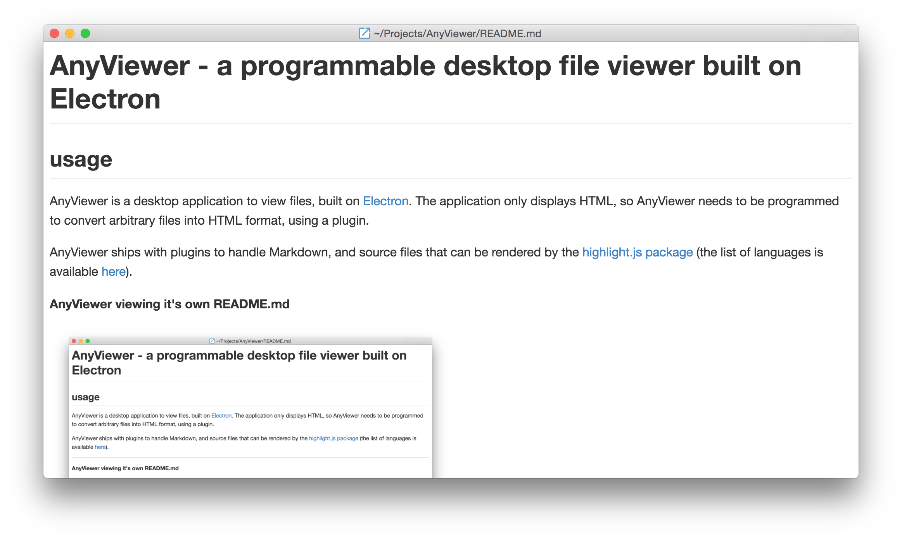
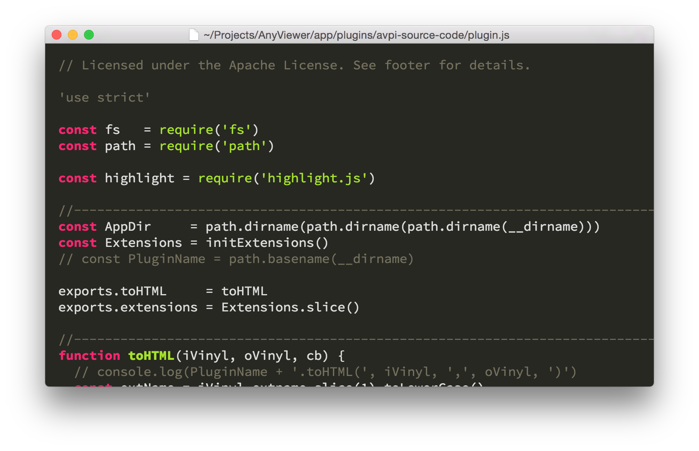

AnyViewer - a programmable desktop file viewer built on Electron
================================================================================

AnyViewer is a desktop application to view files, built on
[Electron](http://electron.atom.io/).
The application only displays HTML, so AnyViewer needs to be programmed to
convert arbitrary files into HTML format, using a plugin.

AnyViewer ships with plugins to handle Markdown, and source files that
can be rendered by the
[highlight.js package](https://www.npmjs.com/package/highlight.js) (the list
of languages is available
[here](https://github.com/isagalaev/highlight.js/tree/master/src/languages)).

**AnyViewer viewing it's own README.md**



**AnyViewer viewing one of it's JavaScript source files**




features
================================================================================

* Font-size changes can be made via menu and shortcuts, the same way you
  change "zoom" pages in the Chrome web browser.  The last change you made
  is set as the default size for all future viewer windows.

* The last change you made to the height and width of the windows are set
  as the default values for all future viewer windows.

* A file which is being viewed is tracked for changes; when the file changes
  on disk, the view will be reloaded with the new contents.

* Print files with background colors and images, with a font-size that
  renders the text fairly readable on a tablet when printed to PDF file.

* You can open a Chrome Dev Tools window via menu and shortcut, if you like to
  or need to peek behind the curtains.


install
================================================================================

You can download a pre-built binary from the
[releases page](https://github.com/pmuellr/AnyViewer/releases).


Mac OS X notes
--------------------------------------------------------------------------------

Unzip the archive, and move the resulting `AnyViewer.app` folder to an
appropriate location.

AnyViewer associates itself with `.md` files when installed.  So, you can:

* double-click an `.md` file from Finder
* run  `open someFileName.md` from the Terminal
* drag / drop a file from Finder onto an AnyViewer icon in your Dock

Once open, you can open other viewer windows through the
**File** / **Open File ...** menu item.

You can associate AnyViewer with other file extensions, by [following these
instructions](http://www.imore.com/how-change-default-apps-os-x).


Windows notes
--------------------------------------------------------------------------------

Windows builds are not tested, they are the build outputs of
[`electron-packager`](https://npmjs.org/package/electron-packager).
Please [create an issue](https://github.com/pmuellr/AnyViewer/issues) for
problems encountered.


Linux notes
--------------------------------------------------------------------------------

Linux builds are not tested, they are the build outputs of
[`electron-packager`](https://npmjs.org/package/electron-packager).
Please [create an issue](https://github.com/pmuellr/AnyViewer/issues) for
problems encountered.


plugins
================================================================================

In order to have a custom HTML renderer for a particular file extension, you'll
need to install a plugin.  A plugin is a node package installed in a particular
location.  That location is the directory named `plugins` in the AnyViewer data
directory.  The AnyViewer data directory in your home directory, named
`.AnyViewer`, and stores other preference-y data.

Each plugin should be in a separate directory, in the same vein as node's
`node_modules` directory.  The `package.json` file for each package should have
a property: `AnyViewer`, whose value is an object (described below), but
otherwise should be an `npm`-installable package.  Packages without an
`AnyViewer` property are not considered plugins.

The `AnyViewer` object in a `package.json` file should be an object, and can
have the following properties:

* `plugin`: the value of this property should be a reference to a module
  moduleID that is the primary entrypoint to the plugin.  Very similar to
  [package.json's `main`](https://docs.npmjs.com/files/package.json#main).

The plugin's primary entrypoint should be a module which exports the following
properties:

* `toHTML`: a function of shape `toHTML(vinylIn, vinylOut, cb)`.
  This function is invoked to convert the original file being opened to HTML.
  The `vinyl*` parameters are
  [vinyl File objects](https://www.npmjs.com/package/vinyl),
  probably just with the file name values.

  * `vinylIn` is the file that was requested to be open.
  * `vinylOut` is an output file which will be rendered
    in the HTML viewer - so it should be HTML.  The plugin is expected
    to write the HTML content to the specified file name.
  * The `cb` parameter is a callback of the shape cb(err).  Invoked this
    function when you have finished writing the HTML back, passing `null`
    as `err` on success, else an Error object.

  The path set in `vinylOut` is a temporary file name, which you can use
  to generate HTML into.  The file will be erased when the viewer window
  closes.

* `extensions`: an array of strings of extensions supported by this plugin.
  Should not include the `"."` character at the beginning of each string,
  unlike [vinyl's extname property](https://www.npmjs.com/package/vinyl#extname).
  You can provide "multi-part" extensions, so for instance the `extension`
  array could be `["foo.md"]`, which would indicate that files of the form
  `*.foo.md` would be handled by the plugin. In the case of two plugins,
  one handling `["foo.md"]` and one handling `["md"]`, the one with the
  most "parts" in it wins - `"foo.md"` in this case.


sample plugin
================================================================================

By default, AnyViewer will view `.html` files with syntax highlighting of the
HTML source.

Described below is a sample plugin which overrides that viewer, with one that
renders the HTML as a web page.

It's not terribly practical -
this plugin does not fix relatively referenced resources (images, css files,
etc), so those files won't be loaded when the HTML is rendered in Anyviewer.
But, it's a simple example.

These files should be stored in the directory `~/.AnyViewer/plugins/avpi-html`
(in your home directory).

### file `package.json`

```json
{
  "name":         "avpi-html",
  "description":  "AnyViewer plugin for HTML",
  "AnyViewer": {
    "plugin":     "./plugin"
  }
}
```

### file `plugin.js`

```js
const fs = require("fs")

exports.toHTML     = toHTML
exports.extensions = ["html"]

function toHTML(iVinyl, oVinyl, cb) {
  const content = fs.readFileSync(iVinyl.path, "utf8")
  fs.writeFileSync(oVinyl.path, content)

  cb()
}
```


building
================================================================================

* clone this repo
* run `npm install` to install dependencies
* run `npm run build` to build the execute

Executables and archives for all platforms will be in the `build` directory.


hacking
================================================================================

This project uses [cake](http://coffeescript.org/#cake) as it's
build tool.  To rebuild the project continuously, use the command

```bash
npm run watch
```

Other `cake` commands are available (assuming you are using npm v2) with
the command

```bash
npm run cake -- <command here>
```

Run `npm run cake` to see the other commands available in the `Cakefile`.


contributing
================================================================================

Awesome!  We're happy that you want to contribute.

Make sure that you're read and understand the
[Code of Conduct](CODE_OF_CONDUCT.md).


license
================================================================================

The AnyViewer specific code in this application is licensed under the Apache License, Version 2.0. You may obtain a copy of the License at

<http://www.apache.org/licenses/LICENSE-2.0>
